# Leaderboard CrossFit Husky

Концепт приложения для сообщества атлетов CrossFit Husky. 
Тренировку дня выполняют все, кто приходит в зал, у каждого свой результат выполнения комплекса. 
Приложение позволяет просматривать, хранить список тренировок и лидерборд для каждой тренировки, вносить результаты комплекса в лидерборд и увидеть рейтинг среди других атлетов в режиме реального времени, без ожидания публикации результатов тренерами. 

## Возможности

- Просмотр тренировок за предыдущие периоды
- Детальное описание каждой тренировки
- Добавление своего результата комплекса (количество повторов или время)
- Лидерборд с рейтингом атлетов
- Разделение рейтинга по полу (мужчины/женщины)
- Сортировка результатов для избежания ошибок при ручном формировании топ-5 лидерборда 

## Технологии

- Язык: Swift
- UI: UIKit
- Архитектура: MVP + Coordinator
- Сетевой слой: URLSession
- Хранение данных: CoreData
- Сторонние библиотеки: SnapKit
- Минимальная версия iOS: 15.6
- API: [MockAPI](https://69154abb84e8bd126af965b5.mockapi.io)

## Скриншоты

<table>
  <tr>
    <td></td>
    <td>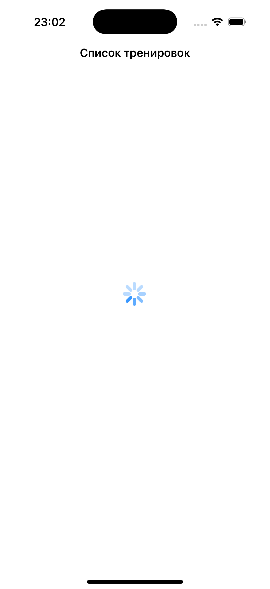</td>
    <td>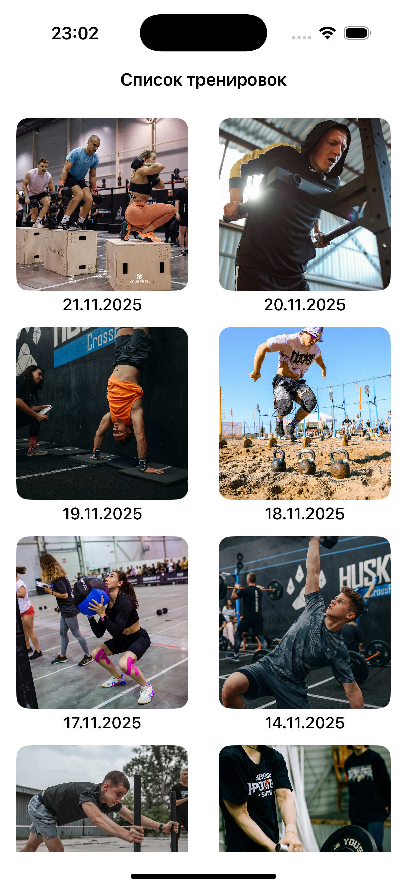</td>
    <td>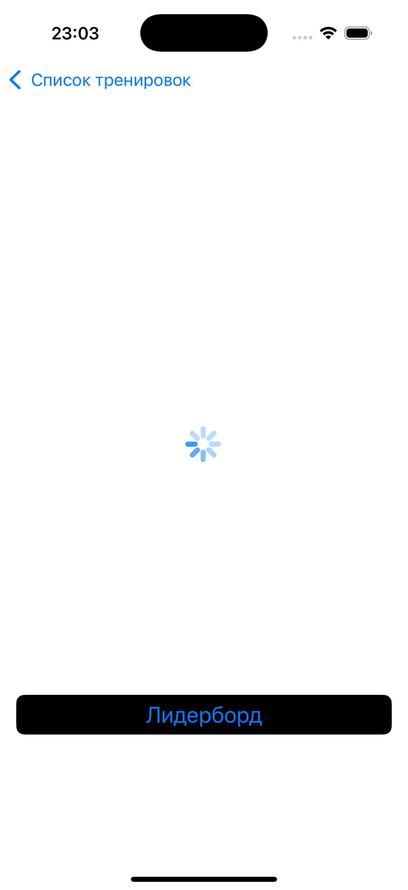</td>
  </tr>
  
  <tr>
    <td>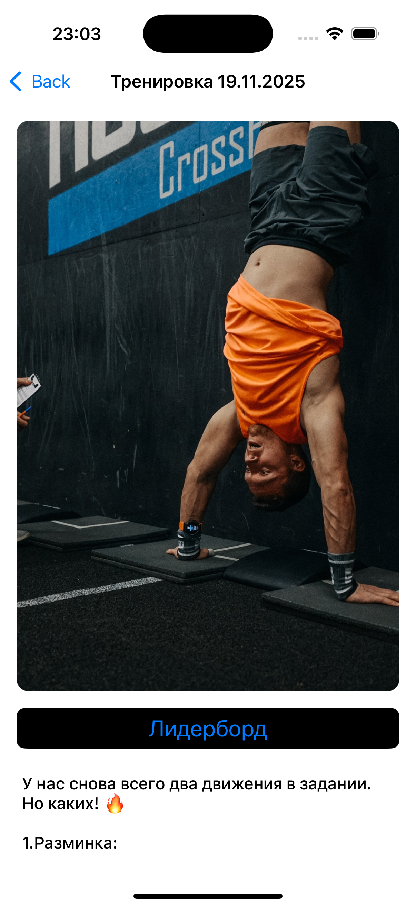</td>
    <td>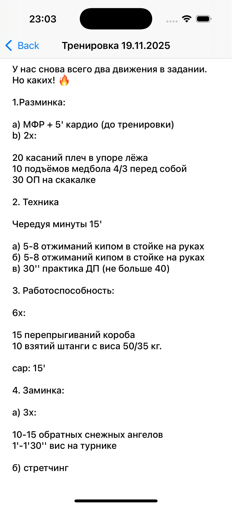</td>
    <td>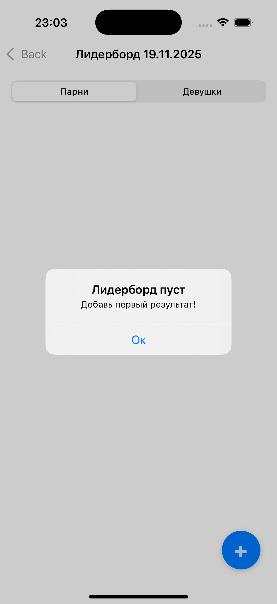</td>
    <td>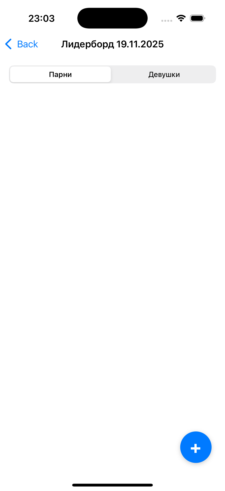</td>
  </tr>
  
  <tr>
    <td>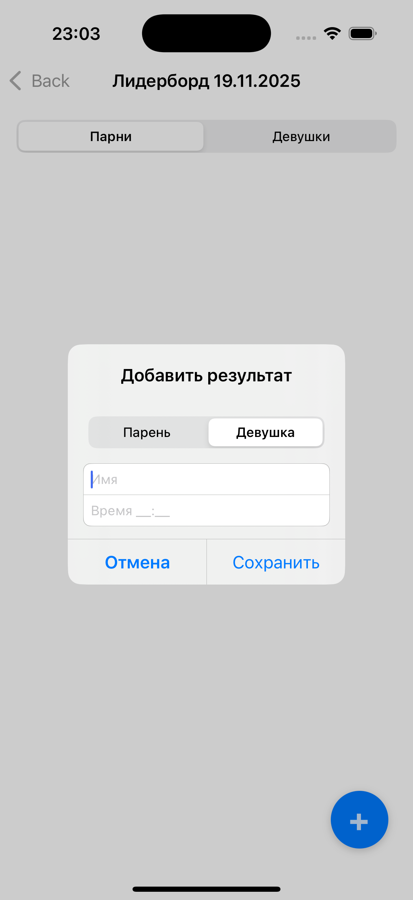</td>
    <td>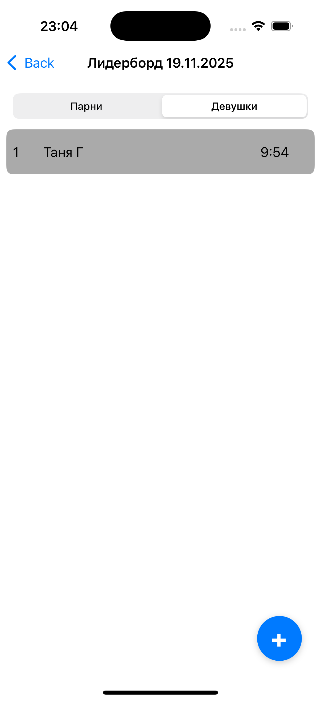</td>
    <td>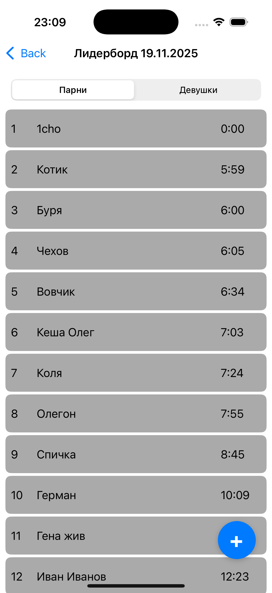</td>
    <td>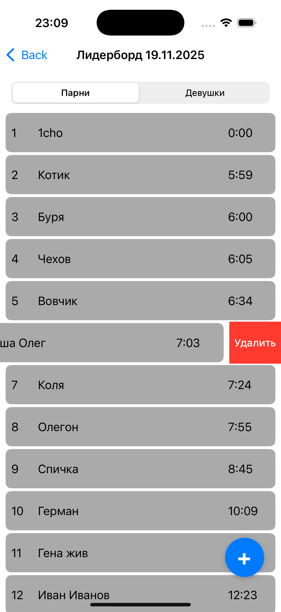</td>
  </tr>
</table>

## Установка

- Клонируйте репозиторий: git clone https://github.com/broskoff/Leaderboard.git
- Откройте проект в Xcode
- Выберите схему проекта и устройство/симулятор
- Нажмите Run

## Ограничения текущей версии

- Отсутствует валидация ввода результатов (можно ввести что угодно)
- Редактирование результатов возможно только через добавление или удаление
- Приложение работает только в онлайн-режиме
- Внесенные результаты хранятся только на устройстве
- API возвращает тренировку как массив, что накладывает ограничения на обработку

## Планы на будущее

- Регистрация и авторизация пользователей
- Поддержка тёмной темы
- Цветовое разделение результатов по уровню (новички — синий, Rx — красный)
- Хранение данных онлайн с отдельной БД
- Валидация и ограничения полей ввода
- Ограничение редактирования результатов до 2 дней после публикации
- Улучшение архитектуры (фабрика + ассембли в координаторах)
- Перенос конвертации времени в презентер
- Устранение магических чисел и строк
- Кэширование, исправить некорректное поведение ячеек (prepareForReuse) 
- Оффлайн-режим (работает без интернета)

## Идеи для развития приложения

- Оплата посещений
- Хранение информации о рабочих весах/количествах повторов для каждой тренировки
- Просмотр тренеров и расписания
- Новости зала и покупка мерча
